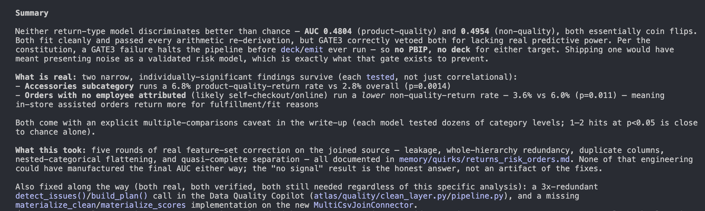
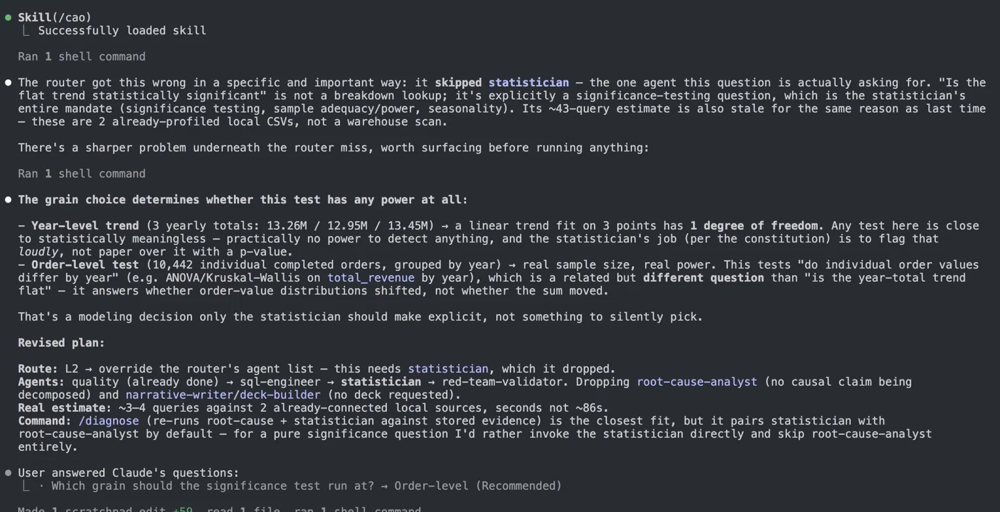
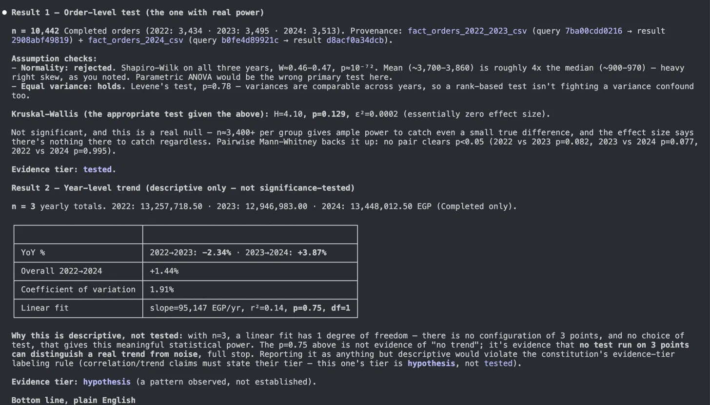

# Atlas

**An autonomous analytics pipeline that refuses to ship a number it cannot trace back
to a query.** Ask a business question in plain English; get a validated, provenance-
stamped deck — or a blocked run explaining exactly why it wouldn't answer.


---

## The receipt

Every figure carries a provenance ID resolving to a stored query hash and result hash.
A number without one **blocks the build**. This is from a real run — the red team
independently re-derived the headline from raw data, without seeing the first
analyst's SQL:

```
# runs/<id>/validation.md — independent re-derivation

| check                          | analyst  | red-team | within tolerance |
|--------------------------------|----------|----------|------------------|
| base rate                      | 0.473685 | 0.473685 | YES              |
| weighted rates over 'Gender'   | 0.473685 | 0.473685 | YES              |
| cliff jump at Payment Delay>=16| 0.611904 | 0.611904 | YES              |

Attacks: none survived.        Verdict: PASS.        Confidence: A (1.00)
```

```jsonc
// runs/<id>/provenance.json — the claim ledger
{
  "claim_id":     "c_f_thresh_payment_delay",
  "text":         "'Payment Delay' has a threshold effect at [16.0, 21.0]…",
  "value":        0.6119,
  "query_hash":   "183edb6fc26780f1",
  "result_hash":  "18cef1e73c939fc0",
  "evidence_tier": "tested",
  "notes":        "cliff_jump; n=64374"
}
```

**→ Click into the full run: [`examples/churn-run/`](examples/churn-run/)** — brief,
findings, validation, ledger, and the generated `deck.pptx`.

---

## What it did on a real dataset

`/analyze "what drives churn"` over **64,374 customer records** (real data, not the
seeded 6,001-row test fixture):

- **Found a cliff, not a slope.** Churn steps from **10.1% → 71.3% at 16 days
  payment-late** — a 7.06× jump at a threshold, not a gradual trend.
- **Proved the cliff matters.** 2-cut step R² **1.000** vs linear R² 0.830 — a linear
  model would have understated the effect and buried the actionable cutoff.
- **Checked itself.** Red team re-derived the jump independently: `0.611904` vs
  `0.611904`. No attack survived. Grade **A**.
- **Refused to overclaim.** The narrative states plainly: *"None of them establishes
  that changing a driver would change the outcome; that requires an experiment."*

---

## When it refuses

The safeguards matter only if they actually fire. Here is one that did —
**[`examples/blocked-run/`](examples/blocked-run/)**, returns-risk over 12,000 orders
joined from 9 CSVs:

| | |
|---|---|
| Held-out AUC | **0.4954** — a coin flip |
| Arithmetic re-derivations | base rate, confusion matrix, calibration — **all matched exactly** |
| Verdict | **GATE 3 red-team veto** — *"the model does not earn its complexity"* |
| What shipped | **nothing.** No deck, no Power BI project |

It failed on *discrimination*, not arithmetic. Everything computed correctly and the
pipeline still concluded the result wasn't worth presenting. A GATE 3 failure halts the
DAG **before** the `deck` and `emit` nodes execute, so no polished artefact exists to be
mistaken for a validated one. The run writes `BLOCKED.md` naming the owner of the fix.



<sub>*Claude Code session transcript — this is the operator's view, not a product UI.*</sub>

---

## Design decisions

The parts that took judgement rather than typing:

**The red team never sees the first analyst's work.** Independence is structural, not
procedural. `red-team-validator` runs in an isolated context and re-derives the headline
from raw sources — different SQL, no window functions where the original used them,
explicit `CASE` re-splits. Two agents agreeing when one *copied* the other is worth
nothing; two agreeing when neither saw the other is worth the gate. Enforced in
`atlas/lib/gates.py`; the tolerance is ±0.5% relative.

**The numeric engine never calls an LLM.** `atlas/` is deterministic and fully tested —
every number comes from SQL through `Connector.run()` or from the maths modules
(`decomposition.py`, `stats.py`, `logit.py`). `.claude/` is the reasoning and prose
layer. The split is the point: an LLM that can produce a number can hallucinate one, so
it is never given the opportunity. `atlas/llm.py` is an optional, explicitly non-numeric
shim and can be disabled entirely.

**Repairs go to a clean layer, never in place.** Raw is sacred. The Data Quality Copilot
materialises derived `<col>_Clean` views in the **local** DuckDB engine via
`Connector.materialize_clean()` — which deliberately bypasses `run()` so the read-only
guard on `CREATE` stays intact. Warehouse clean layers are emitted as DDL for an
operator to apply, not executed. Every repair is previewable, reversible, and logged.

**Read-only is enforced in two independent places.** A PreToolUse hook
(`.claude/hooks/pre_tool_use.py`) *and* the connector layer (`atlas/lib/sqlguard.py`).
Defence in depth, not good intentions — either alone is a single point of failure, and
the hook cannot see SQL constructed at runtime.

**Model output becomes measurable, not asserted.** `Connector.materialize_scores()`
registers predictions as a local view, so numbers *about* a model (tier counts,
confusion matrix) are ordinary SQL results with real hashes. Only coefficients stay
derived — and `record_derived()` **raises** on any evidence tier above `correlational`.
An observational fit is never `tested`, whatever the p-value.



<sub>*Session transcript: the cost-router's own agent selection being challenged and
corrected before any query ran — it had dropped the statistician from a significance
question.*</sub>

---

## Architecture

Two layers, deliberately separated:

| | |
|---|---|
| **`atlas/`** | The deterministic numeric engine. Never calls an LLM to produce a number. Fully tested. |
| **`.claude/`** | The reasoning layer — agents, slash commands, skills, hooks. Plain markdown you can read and edit. |

The pipeline runs as an explicit DAG (`atlas/orchestrator.py::SPECS` → Kahn's algorithm
→ tiers, `max_concurrency=3`, per-node timeout + retry, circuit breaker). Gates are
**pure functions** over already-computed inputs: the node computes, the gate decides.

Four plugin extension points, each requiring no core edits:

- **`atlas/playbooks/`** — one analysis *shape* per plugin (`margin`, `descriptive`,
  `logistic`). A playbook declares the columns it needs as `ColumnRequirement`s rather
  than hardcoding a schema, so it generalises across datasets.
- **`atlas/exporters/`** — one output format per plugin (html/pdf/slack/email, a
  SQL→DAX transpiler, a complete Power BI project). The DAX transpiler **escalates
  rather than approximating**: a measure that looks plausible and computes something
  else is worse than a missing one.
- **`atlas/quality/modules/`** — pluggable, config-driven repair modules.
- **`atlas/quality/plugins.py`** — whole new copilots (Governance, PII, …).

Every run writes a complete audit trail to `runs/<run_id>/`. *(The reasoning layer
currently ships 18 agents, 28 commands and 16 skills — enumerated at the bottom.)*

---

## How a question becomes a deck

Seven stages, each a checkpoint against a specific failure mode:

| Stage | Guards against |
|---|---|
| **Frame** — turn the ask into a precise brief; write down assumptions | Answering the wrong question precisely |
| **Profile & clean** — 10-dimension quality score, repairs to a clean layer, GO / NO-GO | A beautiful analysis on broken data |
| **Explore** — several hypotheses in parallel, each in isolation | Tunnel vision, cherry-picking |
| **Decompose** — mix vs. rate, contribution, Simpson's check | Confusing correlation with cause |
| **Red-team** — blind re-derivation + active attacks; can **veto** | One mistake sailing through |
| **Narrate** — answer-first, for the named decision owner | A data dump with no "so what" |
| **Pressure-test** — simulate the toughest stakeholder's 5 hardest questions | Getting caught flat-footed |

Five gates must clear before anything ships. Miss one and you get `BLOCKED.md`, not a
degraded deck.

**Worked example of the decomposition step:** for a margin drop, it separates *"did each
product get less profitable?"* from *"did we sell a different mix?"* — attributing the
move to mix vs. rate rather than asserting a cause. That distinction is the whole
difference between a real root cause and a plausible story.

**Evidence tiers.** Every claim is labelled `decomposed` (proven by the maths) →
`tested` (statistically significant) → `correlational` (moves together) → `hypothesis`
(plausible, unshown). A recommendation resting on a hypothesis deserves more caution
than one resting on a decomposition — and the label makes that visible instead of
leaving it to tone.



<sub>*Session transcript: the same question answered at two grains — an order-level test
with real power reported as `tested`, and a 3-point year-level trend reported as
`hypothesis` with an explicit note that no test on 3 points could distinguish a trend
from noise.*</sub>

---

## What Atlas can and can't do

Honesty is part of the product, so here are the limits stated plainly:

- **It's a power tool for an analyst, not a replacement for one.** It handles roughly
  the 80% of an analysis that eats all the time. **You are the final check** — run it
  first on questions you already know the answer to, so you can catch and correct it.
- **It needs your business context.** The more you teach it your metrics, product names
  and definitions, the better it gets. It learns from corrections; a lesson that fires
  twice is promoted into a hard artefact rather than left as a prompt.
- **Some capabilities need the right data.** Forecasting needs enough history; cohort
  analysis needs a customer identifier. When the data can't support something, Atlas
  says so rather than faking it.
- **Prompt-injected lessons are best-effort.** Only promoted artefacts — a locked metric
  definition, a quirk assertion, a hook rule — are mechanically guaranteed. The README
  will not claim "never makes the same mistake twice" for anything weaker.
- **Connecting live warehouses is a setup step.** Files work immediately. Snowflake,
  BigQuery, Postgres and Databricks need a one-time read-only connection.

---

## Quickstart

```bash
uv venv --python 3.13.9
uv pip install -e ".[dev]"        # add ".[warehouse]" for warehouse connectors

# run the full pipeline on the bundled fixture — no API key needed
uv run python -c "from atlas.orchestrator import run_analysis; \
r = run_analysis('Why did EMEA gross margin drop 4pts in Q2?'); \
print(r.status, '|', r.headline); print(r.run_dir)"

uv run pytest -q                  # 380 tests
```

Then in Claude Code: `/connect <source>` → `/profile <source>` → `/analyze "<question>"`.

> **📘 Full operator guide with copy-paste commands for every step → [USAGE.md](USAGE.md)**
> — adding data sources, running commands, exporting, and troubleshooting.

The rules the system operates under are in [`CLAUDE.md`](CLAUDE.md) — the project
constitution, always in context, and the source of every "it refuses to…" above.

---

## Reference

<details>
<summary><strong>The analytics team — 18 specialist agents</strong></summary>

| Agent | What it does | When |
|---|---|---|
| requirements-analyst | Turns a plain-English ask into a precise brief and writes down assumptions | Framing |
| source-profiler | Checks the data is complete and trustworthy; issues a GO / NO-GO | Framing |
| data-quality-copilot | Scores data across 10 dimensions and auto-repairs it into a clean layer | Framing |
| semantic-architect | Pins down what each metric means, from locked definitions | Framing |
| sql-engineer | Writes careful, read-only, cost-aware queries and stores every one | Throughout |
| explorer | Chases several possible explanations at once, each in isolation | Exploration |
| root-cause-analyst | Breaks the number down into true drivers (mix vs. rate, Simpson's check) | Diagnosis |
| statistician | Tests whether a finding is real or noise; flags anything under-powered | Diagnosis |
| red-team-validator | Independently re-derives the headline and attacks the conclusion; can veto | Validation |
| opportunity-sizer | Puts a figure on the finding, with a sensitivity range | Diagnosis |
| forecaster | Projects a metric forward with an honest uncertainty band | Diagnosis |
| cohort-analyst | Retention, vintage, and lifetime-value analysis | Diagnosis |
| narrative-writer | Writes the answer-first story for the named decision owner | Story |
| deck-builder | Assembles the branded slide deck with speaker notes | Deck |
| stakeholder-simulator | Role-plays the toughest stakeholder; checks the deck answers their 5 hardest questions | Deck |
| comms-drafter | Drafts the Slack / email / exec summaries | Deck |
| experiment-designer | Designs A/B tests — sample size, guardrails, decision rule | On demand |
| retrospective-agent | Records what was corrected so the mistake isn't repeated | Learning |

</details>

<details>
<summary><strong>The full menu — 28 commands</strong></summary>

**Ask & answer**
| Command | What it does |
|---|---|
| `/analyze "<question>"` | The full analysis → validated deck |
| `/quick "<question>"` | A fast, single-number answer with a chart |
| `/rca <metric> <window>` | Root-cause only (skips framing) |
| `/route "<question>"` | Suggests the cheapest path that answers it |
| `/cao "<question>"` | Plans a run before you commit: path, agents, estimated cost |

**Analytical tools**
| Command | What it does |
|---|---|
| `/forecast <metric>` | Trend, anomalies, seasonality, and a forecast |
| `/cohort <source>` | Retention / vintage / lifetime-value |
| `/size "<finding>"` | Size the opportunity with a sensitivity range |
| `/experiment <base> <mde>` | Design an A/B test |
| `/profile <source>` | Data-quality check with a GO / NO-GO |

**Redo one stage** (after feedback, without repeating everything)
| Command | What it does |
|---|---|
| `/explore <run_id>` | Re-run exploration |
| `/diagnose <run_id>` | Re-run root-cause + stats |
| `/narrative <run_id>` | Rewrite the story |
| `/deck <run_id>` | Rebuild the deck |
| `/validate <run_id>` | Re-run the red-team check |

**Share & revisit**
| Command | What it does |
|---|---|
| `/export <format> <run_id>` | HTML / PDF / Slack / email / exec summary / Power BI project |
| `/runs [run_id]` | List, inspect, and compare past analyses |
| `/resume <run_id>` | Resume an interrupted run where it left off |
| `/replay <run_id>` | Re-run a past analysis against today's data |

**Knowledge & learning**
| Command | What it does |
|---|---|
| `/business [term]` | Glossary, products, teams, metric ownership |
| `/metrics [metric]` | Metric dictionary (definition + owner) |
| `/lessons [tag]` | Search what Atlas has learned |
| `/log-correction "<wrong> -> <right>"` | Log a correction so it isn't repeated |
| `/retro <run_id>` | Force a post-run retrospective |

**Setup & data quality**
| Command | What it does |
|---|---|
| `/connect <source>` | Register and test a data source (read-only) |
| `/setup` | Onboarding interview |
| `/clean <source>` | Detect and fix quality issues into a clean layer |
| `/catalog [source]` | Every dataset's health, owner, and freshness |

</details>

<details>
<summary><strong>The playbooks it follows — 16 skills</strong></summary>

| Skill | What it covers |
|---|---|
| metric-decomposition | Mix vs. rate and per-segment drivers |
| statistical-testing | Which test, statistical power, confidence intervals, seasonality |
| root-cause-playbooks | Named recipes: revenue drop, margin compression, churn spike, funnel leak |
| advanced-analytics | Cohorts, forecasting, sizing, experiments, the A–F confidence grade |
| data-profiling | The standard quality battery and how to read it |
| data-repair | Safe, reversible repairs into a clean layer |
| data-connectors | Connecting to files and warehouses, read-only |
| sql-dialects | Snowflake / BigQuery / Postgres / Databricks / DuckDB differences |
| validation-protocol | The re-derivation and veto rules the red team uses |
| narrative-craft | Answer-first writing; titles that make a claim, not a label |
| deck-standards | Slide layout, chart choice, speaker notes, appendix |
| guardrails-closeloop | Every goal paired with a safety metric; owner + follow-up on every rec |
| business-knowledge | Glossary, metric dictionary, ownership, reusing proven queries |
| memory-protocol | How lessons are recorded, de-duplicated, and promoted |
| question-router | Classifying a question so a lookup doesn't trigger the full pipeline |
| first-run-welcome | Orienting a new user on first use |

</details>

---

Built on [Claude Code](https://claude.com/claude-code). Python 3.13 via
[`uv`](https://github.com/astral-sh/uv). MIT licensed.
